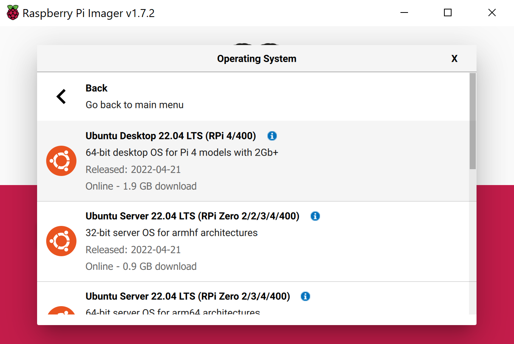

# A Closed Captioning Example on RaspberryPi using Azure Cognitive services

We are going to try out the Azure Cognitive services from Microsoft and build an example of the Speech to text on a IoT device like raspberry.
We will be using youtube videos for our source of speech which would be the input, we will consume the speech data via Mic connected to raspberry and display the converted text in real time over a LCD screen.

## Hardware Requirement
1. [RaspberryPi](https://thepihut.com/collections/featured-products/products/raspberry-pi-4-model-b) 
   : We will be using the 4GB variant.
   1. [A power supply](https://thepihut.com/products/raspberry-pi-psu-uk)
   2. [Micro SD card](https://thepihut.com/products/sandisk-microsd-card-class-10-a1)
   3. [MicroSD Card Reader](https://thepihut.com/products/mini-usb-2-0-microsd-card-reader)
2. [Mic Usb plug n Play](https://thepihut.com/products/mini-usb-microphone)
   : Any USB plug and play device can do the job.
3. [Lcd Screen](https://thepihut.com/products/7-capacitive-touchscreen-lcd-low-power-800x480)
   : We are using this for rich text quality and setting up most of our stuff. You can use any other compatible displays.
4. [Pair of Keyboard and Mouse](https://www.amazon.eg/-/en/HP-CS700-Wireless-Keyboard-Mouse/dp/B07M82KFVB)
   : A basic keyboard mouse for using as input devices on raspberry.
   
## Setting up Raspberry 4
Raspberry Pi can run a fully Desktop OS which can be loaded onto an MicroSD card.

Now on your desktop computer Download and Install [Raspberry Pi Imager](https://www.raspberrypi.com/software/)

First we select storage device, connect the Microsd card to card reader connect to computer.

Now you will be seeing the connected device as storage device, select it.

We will be using Ubuntu Desktop 64 bit, so first select the other available OS. (Although Raspbian does come in a 64bit version but Ubuntu seem to have better support for the architecture and available software)

From there we select the ubuntu 22 64 bit version.

Now after clicking write you see a similar loading bar. let it complete the process.

