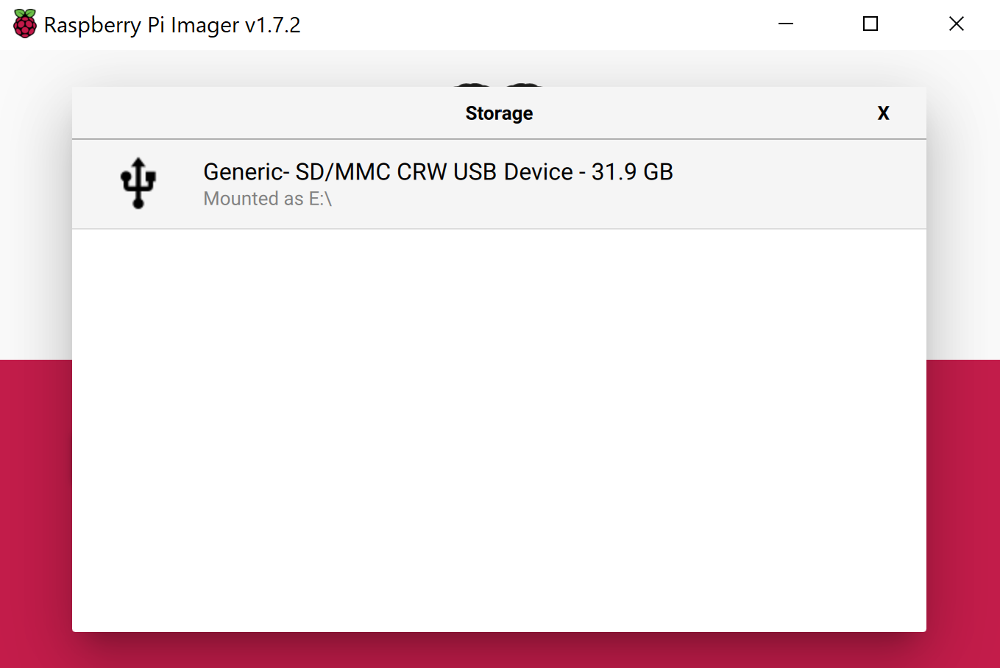
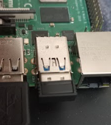
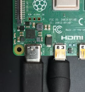

# A Closed Captioning Example on RaspberryPi using Azure Cognitive services

We are going to try out the Azure Cognitive services from Microsoft and build an example of the Speech to text on a IoT device like raspberry.
We will be using youtube videos for our source of speech which would be the input, we will consume the speech data via Mic connected to raspberry and display the converted text in real time over a LCD screen.

## Hardware Requirement
1. [RaspberryPi](https://thepihut.com/collections/featured-products/products/raspberry-pi-4-model-b) 
   : We will be using the 4GB variant.
   1. [A power supply](https://thepihut.com/products/raspberry-pi-psu-uk)
   2. [Micro SD card](https://thepihut.com/products/sandisk-microsd-card-class-10-a1)
   3. [MicroSD Card Reader](https://thepihut.com/products/mini-usb-2-0-microsd-card-reader)
2. [Microphone Usb plug n play](https://thepihut.com/products/mini-usb-microphone)
   : Any USB plug and play device can do the job.
3. [Lcd Screen](https://thepihut.com/products/7-capacitive-touchscreen-lcd-low-power-800x480)
   : We are using this for rich text quality and setting up most of our stuff. You can use any other compatible displays.
4. [Pair of Keyboard and Mouse](https://www.amazon.eg/-/en/HP-CS700-Wireless-Keyboard-Mouse/dp/B07M82KFVB)
   : A basic keyboard mouse for using as input devices on raspberry.
   
## Download and Install RaspberryPi 4 OS
Raspberry Pi can run a fully Desktop OS which can be loaded onto an MicroSD card.

Now on your desktop computer Download and Install [Raspberry Pi Imager](https://www.raspberrypi.com/software/)


First we select storage device, connect the Microsd card to card reader connect to computer.

Now you will be seeing the connected device as storage device, select it.



We will be using Ubuntu Desktop 64 bit, so first select the other available OS. (Although Raspbian does come in a 64bit version but Ubuntu seem to have better support for the architecture and available software)


From there we select the ubuntu 22 64 bit version.


Now after clicking write you see a similar loading bar. let it complete the process.


Ok now let's safely eject the sd card and start setting everything over our raspberry pi.

## Setting up the RaspberryPi 4 and Power On

First we insert the sd card into the raspberry pi 4 which can be found underneath the board.


Connect the display via USB (To, Power/Capacitive Touch Input) and HDMI ports.

1. HDMI (Display) to Micro-HDMI (RaspberryPi).


2. Micro-USB (Display) to USB (RaspberryPi)


Connecting USB Mic to an usb port.


Connect the keyboard and mouse, i have a wireless plug and play usb dongle.



Connect the power USB type C.



Ok looking over everything how they should look like.

## Setting up the OS and other dependencies

Ok first power up the device and set up the initial setup, this part would pretty much self-explanatory, but it would have following steps.
   1. You will be presented with initial option to connect to internet over wifi (or you can connect with Ethernet cable).
   2. Select the keyboard layout according and also the timezone.
   3. This bit is important you need make a user account.
   
      
**note** instead of Require my password to log in select the login automatically.
      
### Now to install other dependencies.
Open terminal on desktop.

let's make a directory using terminal.
```bash
mkdir work
cd work
```
### Now we setup .Net Framework as the code is in C#
```bash
curl -sSL https://dot.net/v1/dotnet-install.sh | bash /dev/stdin --channel Current
```
Once the files are installed we set the environment variables.
```bash
echo 'export DOTNET_ROOT=$HOME/.dotnet' >> ~/.bashrc
echo 'export PATH=$PATH:$HOME/.dotnet' >> ~/.bashrc
source ~/.bashrc
```
Check and verify the installation
```bash
dotnet --version
```
### Now we will be installing the dependencies for the Azure speech sdk.

```bash
sudo apt-get update
sudo apt-get install build-essential libssl-dev libasound2 wget 
```
There is a high chance you will be having trouble in installing libssl1.0.0 as its not available for ubuntu 22. But its one of the core required dependencies.
What we will do is manually install it.
```bash
wget http://ftp.us.debian.org/debian/pool/main/o/openssl/libssl1.1_1.1.1n-0+deb11u1_arm64.deb
```
and we simply install from the file
```bash
sudo apt install -f ./libssl1.1_1.1.1n-0+deb11u1_arm64.deb
```
## Lets Signup for azure cognitive services and get our api keys.

https://azure.microsoft.com/en-us/free/

You can sign up for a free trial account with $200 azure credit for 30 days.o

once presented with the dashboard. Select more service (assuming you will already have trial  subscription setup)


now select the cognitive services.


Now create a new speech service


What you will need from here once setup speech service. are the keys and the region.
copy the key anyone would do and copy the location region.


## Running the code on the RaspberryPi

Download install git

```bash
sudo apt install git
```

lets go back in the folder we created
```bash
cd work
```
clone this repository, go to the folder with the code
```bash
git clone https://github.com/m-mohsin-ali/closed-captioning-azure-speech-ai
cd closed-captioning-azure-speech-ai/code/AzureSpeechCC
```
Now lets put your keys in the code
```bash
nano Program.cs
```
```C#
 class Program
    {

        static string YourSubscriptionKey = "Enter your Key Here";
        static string YourServiceRegion = "Enter your Region here";
...
```
Now press crtl+x and save/overwrite.

let's add the Azure Speech Sdk lib/package to the code directory
```bash
dotnet add package Microsoft.CognitiveServices.Speech
```
Now lets run and see the magic
```bash
dotnet build
dotnet run
```
