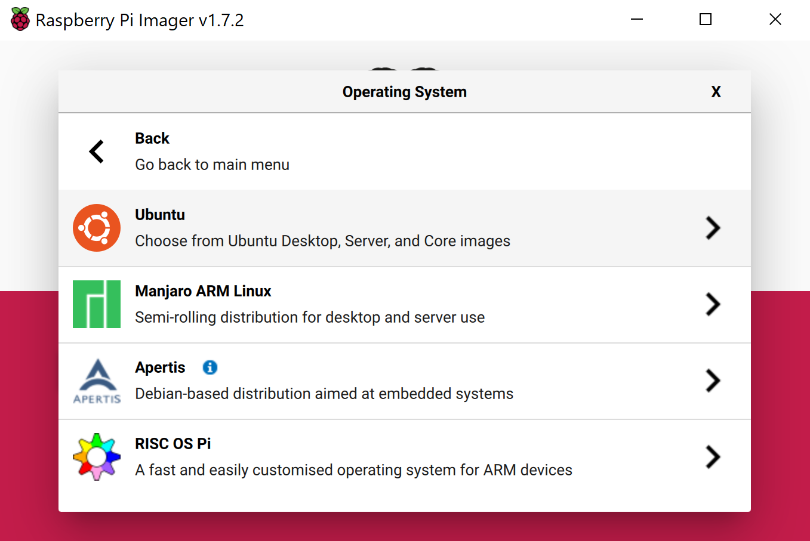
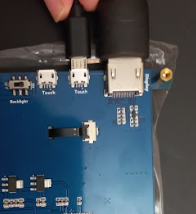

# Raspberry Pi Live Closed Captioning with Azure Cognitive Services

This project uses Microsoft Azure Cognitive Services speech recognition to generate real-time captions on a Raspberry Pi. You can also run this project in a .NET framework on a laptop or computer!

https://user-images.githubusercontent.com/46184494/172901241-2b21438e-2600-4397-a6b6-4cd5b5c7c63d.mp4

Speech is captured via a USB microphone and run through a .NET framework which calls Azure Cognitive Services speech-to-text service, which then displays convert text in real-time captions to an LCD screen. You can also generate captions on [a remote screen via SSH](https://github.com/microsoft/rpi-resources). 


## Hardware Requirements
1. [Raspberry Pi](https://thepihut.com/collections/featured-products/products/raspberry-pi-4-model-b) 
   : We will be using the 4GB version.
   1. [5V power supply](https://thepihut.com/products/raspberry-pi-psu-uk)
   2. [Micro SD card](https://thepihut.com/products/sandisk-microsd-card-class-10-a1)
   3. [MicroSD Card Reader](https://thepihut.com/products/mini-usb-2-0-microsd-card-reader)
2. [Microphone Usb plug n play](https://thepihut.com/products/mini-usb-microphone)
   : Any USB plug and play device works.
3. [Lcd Screen](https://thepihut.com/products/7-capacitive-touchscreen-lcd-low-power-800x480)
   : We are using this for rich text quality. You can use any other compatible displays.
   : You may also skip the scree and access the Pi via SSH.
4. [Pair of Keyboard and Mouse](https://www.amazon.eg/-/en/HP-CS700-Wireless-Keyboard-Mouse/dp/B07M82KFVB)
   : A basic keyboard and mouse for using as input devices on a Raspberry Pi.
   
## Download RaspberryPi 4 OS

1. On your desktop computer, download and install [Raspberry Pi Imager](https://www.raspberrypi.com/software/).

2. Run Raspberry Pi Imager. The home screen will appear.

    

3. Select **'CHOOSE STORAGE'**.

4. Insert the microSD card into your computer (or via a card reader).
  
5. Select the connected microSD card as your storage device.

    
    
6. On the home screen, select **'CHOOSE OS'**.
   
    

7. Select in this order: **'Other general-purpose OS'** > **'Ubuntu'** > **'Ubuntu Desktop 22.04 LTS (RPi 4/400)'**

    
    
    

    > Note: Although Raspbian does come in a 64bit version, Ubuntu has better support for the architecture and available software.

8. On the home screen, select **'WRITE'**.

    

9. A loading bar will appear.  

    

    > NOTE: The Writing may take a few minutes to an hour to complete.

10. Safely eject the SD card and insert it into the Raspberry Pi. 
 
    

## Setting up the RaspberryPi 4 and Power On


1. If you're using a screen, connect the display via USB (To, Power/Capacitive Touch Input) and HDMI ports.




1. Connect Micro-USB (Display) to USB (RaspberryPi)


1. Connect the  USB Mic to a Pi USB port.


1. Connect the keyboard and mouse. We're using a wireless dongle for both keyboard and mouse.


1. Finally, connect the power supply! 

## Setting up the OS and other dependencies

1. Once the Pi boots up, input your SSID and WiFi password. If you prefer, you can also connect to the Internet via an Ethernet cable.

1. Select the keyboard layout for your location and the timezone.


1. Change your password (YES please do this step, it is important for security purposes).
            
### Install Dependencies
1. Open the terminal.

1. Make a directory to store our project by running the following commands
```bash
mkdir live-captioning
cd live-captioning
```
1.Setup the .NET Framework by running the following commands:
```bash
curl -sSL https://dot.net/v1/dotnet-install.sh | bash /dev/stdin --channel Current
```
1. Once the files are installed we set the environment variables by running the following commands:
```bash
echo 'export DOTNET_ROOT=$HOME/.dotnet' >> ~/.bashrc
echo 'export PATH=$PATH:$HOME/.dotnet' >> ~/.bashrc
source ~/.bashrc
```
1. Check and verify the installation
```bash
dotnet --version
```
1. Finally, install the Azure Cognitive Services speech-to-text dependencies with the following commands: 

```bash
sudo apt-get update
sudo apt-get install build-essential libssl-dev libasound2 wget 
```

   * We need to manually install the libssl1.0.0 as its not available for ubuntu 22. Run the following command:
```bash
wget http://ftp.us.debian.org/debian/pool/main/o/openssl/libssl1.1_1.1.1n-0+deb11u1_arm64.deb
```
* Next, install from file:
```bash
sudo apt install -f ./libssl1.1_1.1.1n-0+deb11u1_arm64.deb
```
## Azure Cognitive Services Setup 
Now it's time to sign up for Azure Cognitive Services and get our API keys!

1. Sign up for [a free Azure account here](https://aka.ms/azure/live-captions). Your free trial lasts 30 days and includes $200 Azure credits.


1. Once you're logged in to your Azure dashboard, select 'more service'.


1. Select (or search for) Cognitive Services.


1. Create a new speech service.

1. From here, you will need the keys and the region to set up speech-to-text on the Raspberry Pi.
 

1. Copy one of the keys (any of them will work) and the location region.

## Run the Project!

1. If you don't already have it, install git with the following command:

```bash
sudo apt install git
```

1. Navigate to your project folder that we created earlier:
```bash
cd live-captioning
```
1. Clone this repository and navigate to t: 
```bash
git clone https://github.com/jenfoxbot/closed-captioning-azure-speech-ai
```
1. Navitage to the folder that contains project code: 
```bash
cd closed-captioning-azure-speech-ai/code/AzureSpeechCC

1. Add your Cognitive Services keys keys to the code:
```bash
nano Program.cs
```
```C#
 class Program
    {

        static string YourSubscriptionKey = "Enter your Key Here";
        static string YourServiceRegion = "Enter your Region here";
...
```
1. Press CTRL+X and save/overwrite the file.

1. Add the Azure Speech SDK lib/package to the code directory by running the following:
```bash
dotnet add package Microsoft.CognitiveServices.Speech
```
1. We did it!! Let's run the code and see our wizardry in action:
```bash
dotnet build
dotnet run
```

Test out different audio sources or try different sounds and voices.

## Going Further
1. Make the project portable by getting an enclosure for the Pi, a small touch screen, and a USB-C battery.
2. Travel plans? Convert the project into a translator by selecting different language inputs and outputs from Cognitive Services!

Show us your creations by tagging us: @MakersAtMicrosoft, or using the hashtag #AzureLiveCaptions


